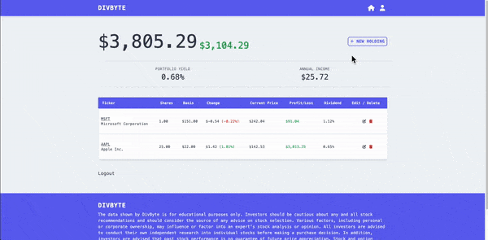

<h3 align="center">Im John, a detail-oriented Software Engineer from New York.</h3>

  
  
  
  

<!-- - 🔭 I’m currently working on [Libberly](https://johnsebastian3.github.io/libberly/) -->

- 💼 I’m currently accepting clients and new full-time offers

- 👨‍💻 Learn more at [https://johnsebastiandev.netlify.app/](https://johnsebastiandev.netlify.app/)

- 📫 Email me at **johnsebastiandev@gmail.com**

<h1 align="center">Projects</h1>
<table bordercolor="#66b2b2">
  
  <tr>
  <td width="50%" valign="top">
      <h3 align="center">BetterBudget</h3>
         
        
         
        

          
    
  
      

        
BetterBudget is a simple-to-use budgeting app. It simplifies the budgeting process so you can have more time in your day along with more money in your pocket at the end of each month. You can customize and personalize your budget, track expenses and income, and even plan budgets for the future.

    </td>
    <td width="50%" valign="top">
      <h3 align="center">DivByte</h3>
         
        
         
        

          
    
  
      

        
A fully responsive Full-Stack application where users can add and track their stock performance with real time market data. Users can create a profile, research stock metrics, leave comments, and check in everyday to see how their portfolio is performing.

    </td>
     <td width="50%" valign="top">
      <h3 align="center">Bella Hair Salon</h3>
         
        
         
        

          
    
  
      

        
A beautiful, fully responsive website for a local salon business.

    </td>    
  </tr>
  
  <tr>
     <td width="50%" valign="top">
      <h3 align="center">Cleave</h3>
       
        
       
        

  
  
      

        
Cleave is a sleek tip calculator. Set the amount of the bill, the percentage you want to tip, and the number of people, and Cleave will split your bill for you. It will determine how much you should tip, and how much each person should tip.

    </td>
    <td width="50%" valign="top">
      <h3 align="center">Libberly</h3>
         
        
         
        

          
  
  
      

        
A minimalistic library app to keep track of read and unread books in your library.

    </td>
    <td width="50%" valign="top">
      <h3 align="center">Luxury Salon</h3>
         
      
         
        

          
  
  
      

        
A responsive, accessible landing page for a Salon business. Built with <strong>Grid</strong> and <strong>Flexbox</strong> to achieve a sleek and modern design.

    </td>
  </tr>
</table>

<h3 align="left">Connect with me:</h3>

<h3 align="left">Languages and Tools:</h3>

               <a href="https://www.cprogramming.com/" target="_blank" rel="noreferrer">  </a>

